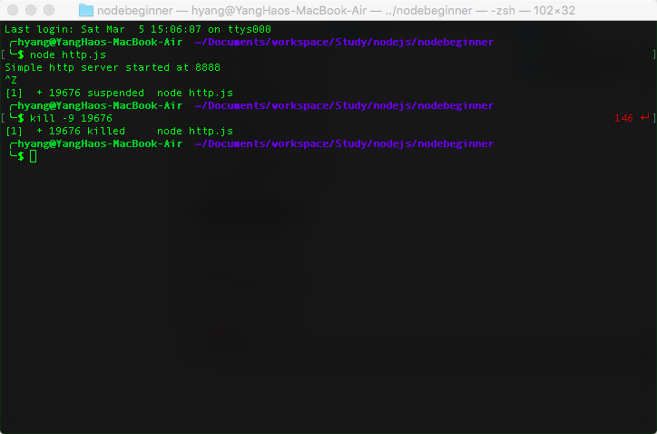
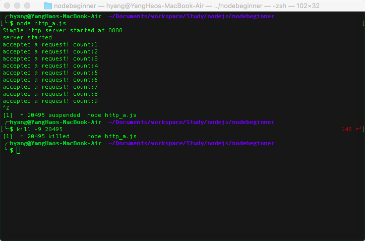

# The Reading Notes of node begninner

---
本文档是[Node Beginner](http://www.nodebeginner.org/index-zh-cn.html)的读书笔记。

### 基本流程

a. 编写代码，然后存入 .js 格式的文件中；（如下面两个代码）

<b>hw.js</b>:

```
	console.log("Hello world!");
```
<b>http.js</b>:

```
	var http = require("http");
	console.log("Simple http server started at 8888");
	http.createServer(function(request, response) {
  		response.writeHead(200, {"Content-Type": "text/plain"});
  		response.write("Hello World");
  		response.end();
	}).listen(8888);
```

b. 运行代码。在terminal中执行下列代码，其中，codefile是js代码文件，后最必为.js

```
	node codefile
```

c. 结束代码，有些代码在执行完成后就会自动退出（如：hw.js），而有些代码会一直执行下去直到被外部终止（如：http.js），为了结束这些进程，需要如下步骤:

1) 获取该进程的ID。可以通过[ctrl + z]将进程挂起，可以看到进程的ID
2) 在terminal中执行
	
```
	kill -9 processID
```
下图展示了上述的3个步骤



### 匿名函数

下列两段代码是等价的

```
	var http = require("http");
	console.log("Simple http server started at 8888");
	http.createServer(function(request, response) {
  		response.writeHead(200, {"Content-Type": "text/plain"});
  		response.write("Hello World");
  		response.end();
	}).listen(8888);
```


```
	var http = require("http");
	function respond(request, response) {
  		response.writeHead(200, {"Content-Type": "text/plain"});
  		response.write("Hello World");
  		response.end();
	}
	console.log("Simple http server started at 8888");
	http.createServer(respond).listen(8888);
```

### 异步执行
http服务器进行监听后，不会阻塞当前进程，代码会继续执行，而http服务器会监听端口，按照所谓的“事件驱动”，每当有一个请求的时候，匿名函数中的代码会被回调执行。

```
var http = require("http");

var visit_count = 0; //count the number of visitors (PV)

console.log("Simple http server started at 8888");
http.createServer(function(request, response) {
  visit_count ++;
  console.log("accepted a request! count:" + visit_count);  // show this message at terminal when one visit 127.0.0.1:8888
  response.writeHead(200, {"Content-Type": "text/plain"});
  response.write("Hello World");
  response.end();
}).listen(8888);

console.log("server started");
```
如下图所示，在服务器启动后，我们访问了127.0.0.1:8888三次，每次匿名函数都会被调用，并进行计数


### 导出模块
