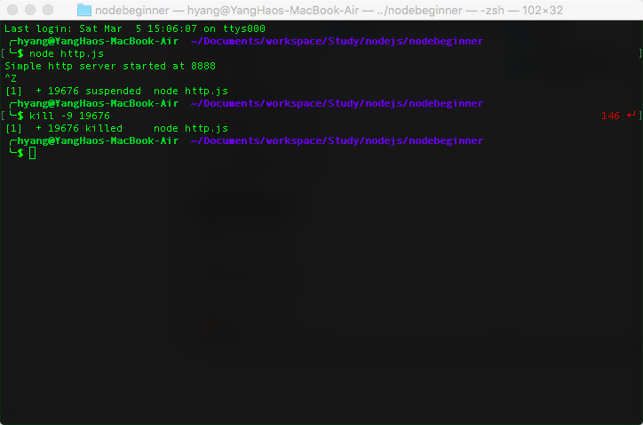
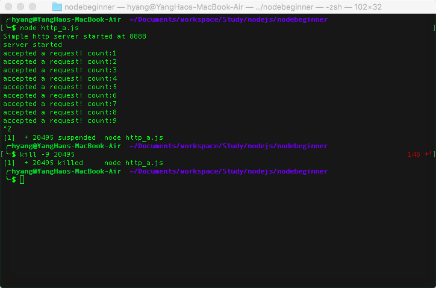
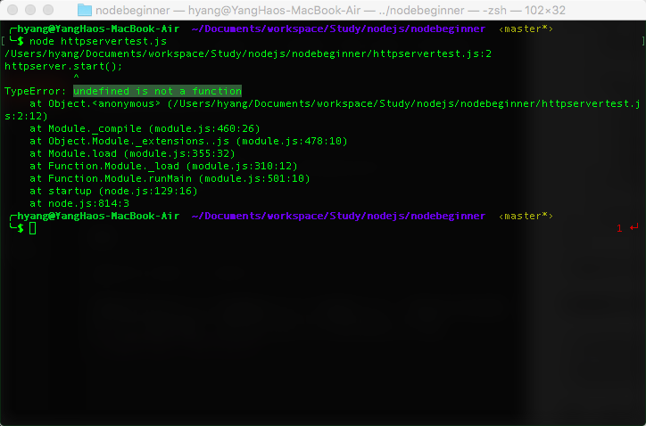

# The Reading Notes of node begninner

---
本文档是[Node Beginner](http://www.nodebeginner.org/index-zh-cn.html)的读书笔记。

### 基本流程

a. 编写代码，然后存入 .js 格式的文件中；（如下面两个代码）

<b>hw.js</b>:

```
	console.log("Hello world!");
```
<b>http.js</b>:

```
	var http = require("http");
	console.log("Simple http server started at 8888");
	http.createServer(function(request, response) {
  		response.writeHead(200, {"Content-Type": "text/plain"});
  		response.write("Hello World");
  		response.end();
	}).listen(8888);
```

b. 运行代码。在terminal中执行下列代码，其中，codefile是js代码文件，后最必为.js

```
	node codefile
```

c. 结束代码，有些代码在执行完成后就会自动退出（如：hw.js），而有些代码会一直执行下去直到被外部终止（如：http.js），为了结束这些进程，需要如下步骤:

1) 获取该进程的ID。可以通过[ctrl + z]将进程挂起，可以看到进程的ID
2) 在terminal中执行
	
```
	kill -9 processID
```
下图展示了上述的3个步骤



### 匿名函数

下列两段代码是等价的

```
	var http = require("http");
	console.log("Simple http server started at 8888");
	http.createServer(function(request, response) {
  		response.writeHead(200, {"Content-Type": "text/plain"});
  		response.write("Hello World");
  		response.end();
	}).listen(8888);
```


```
	var http = require("http");
	function respond(request, response) {
  		response.writeHead(200, {"Content-Type": "text/plain"});
  		response.write("Hello World");
  		response.end();
	}
	console.log("Simple http server started at 8888");
	http.createServer(respond).listen(8888);
```

### 异步执行
http服务器进行监听后，不会阻塞当前进程，代码会继续执行，而http服务器会监听端口，按照所谓的“事件驱动”，每当有一个请求的时候，匿名函数中的代码会被回调执行。

```
var http = require("http");

var visit_count = 0; //count the number of visitors (PV)

console.log("Simple http server started at 8888");
http.createServer(function(request, response) {
  visit_count ++;
  console.log("accepted a request! count:" + visit_count);  // show this message at terminal when one visit 127.0.0.1:8888
  response.writeHead(200, {"Content-Type": "text/plain"});
  response.write("Hello World");
  response.end();
}).listen(8888);

console.log("server started");
```
如下图所示，在服务器启动后，我们访问了127.0.0.1:8888三次，每次匿名函数都会被调用，并进行计数


### 导出模块
为了将代码更好的组织，我们需要将代码按其功能进行组织，分别放在不同的文件中，那么分到不同的文件中之后，我们该如何使用呢？这时候就需要“导出模块”了!

将前面提到的代码中的，创建服务器的代码抽取出来构成如下代码：

```
//httpserver.js
var http = require("http");

function start() {
	var visit_count = 0; //count the number of visitors (PV)
	console.log("Simple http server started at 8888");
	
	http.createServer(function(request, response) {
	  visit_count ++;
	  console.log("accepted a request! count:" + visit_count);  // show this message at terminal when one visit 127.0.0.1:8888
	  response.writeHead(200, {"Content-Type": "text/plain"});
	  response.write("Hello World");
	  response.end();
	}).listen(8888);

	console.log("server started");
}

exports.start = start; // export the start function 
```

将创建的执行抽取代码如下：

```
//httpservertest.js
var httpserver = require("./httpserver");
httpserver.start();
```

其中
```
exports.start = start;
```
表面将代码中的start对象赋给exports对象的start，若将这行代码注释掉，那么会提示错误，表示在httpserver中找不到start方法。

注意，exports的语法为：
```
exports.call_name = local_variable_name
```
call_name：在使用包的时候调用的方法；local_variable_name：局部的需要被导出，以供外部使用的方法的本地名字。
即，若我们将httpserver.js修改如下其中

```
exports.alias = start;
```
那么，在httpservertest.js中，我们修改调用的名称，代码就可正常运行。

```
//httpservertest.js
var httpserver = require("./httpserver");
httpserver.alias();
```

### 请求路由
获取请求中的路由信息
```
var pathname = url.parse(request.url).pathname;
```

然后设计一个路由策略，并实现一个模块，代码如下：

```
//easy_router.js
function route(pathname) {
	console.log("About to route a request for " + pathname);
}
exports.route = route;
```

有了路由模块，现在将路由模块集成到服务器代码中：

```
//router_http_server.js
var http = require("http");
var url = require("url");

function start(route) {
  function onRequest(request, response) {
    var pathname = url.parse(request.url).pathname;
    console.log("Request for " + pathname + " received.");

    route(pathname);

    response.writeHead(200, {"Content-Type": "text/plain"});
    response.write("Hello World");
    response.end();
  }

  http.createServer(onRequest).listen(8888);
  console.log("Server has started.");
}

exports.start = start;
```
最后，生成执行代码

```
//rhstest.js
var server = require("./router_http_server");
var router = require("./easy_router");

server.start(router.route);

```


