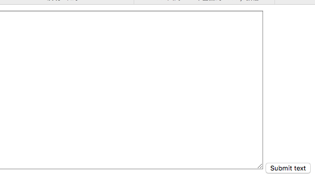
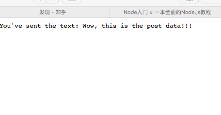

# The Reading Notes of node begninner

---
本文档是[Node Beginner](http://www.nodebeginner.org/index-zh-cn.html)的读书笔记。

### 基本流程

a. 编写代码，然后存入 .js 格式的文件中；（如下面两个代码）

<b>hw.js</b>:

```
	console.log("Hello world!");
```
<b>http.js</b>:

```
	var http = require("http");
	console.log("Simple http server started at 8888");
	http.createServer(function(request, response) {
  		response.writeHead(200, {"Content-Type": "text/plain"});
  		response.write("Hello World");
  		response.end();
	}).listen(8888);
```

b. 运行代码。在terminal中执行下列代码，其中，codefile是js代码文件，后最必为.js

```
	node codefile
```

c. 结束代码，有些代码在执行完成后就会自动退出（如：hw.js），而有些代码会一直执行下去直到被外部终止（如：http.js），为了结束这些进程，需要如下步骤:

1) 获取该进程的ID。可以通过[ctrl + z]将进程挂起，可以看到进程的ID
2) 在terminal中执行
	
```
	kill -9 processID
```
下图展示了上述的3个步骤


### 匿名函数

下列两段代码是等价的

```
	var http = require("http");
	console.log("Simple http server started at 8888");
	http.createServer(function(request, response) {
  		response.writeHead(200, {"Content-Type": "text/plain"});
  		response.write("Hello World");
  		response.end();
	}).listen(8888);
```


```
	var http = require("http");
	function respond(request, response) {
  		response.writeHead(200, {"Content-Type": "text/plain"});
  		response.write("Hello World");
  		response.end();
	}
	console.log("Simple http server started at 8888");
	http.createServer(respond).listen(8888);
```

### 异步执行
http服务器进行监听后，不会阻塞当前进程，代码会继续执行，而http服务器会监听端口，按照所谓的“事件驱动”，每当有一个请求的时候，匿名函数中的代码会被回调执行。

```
var http = require("http");

var visit_count = 0; //count the number of visitors (PV)

console.log("Simple http server started at 8888");
http.createServer(function(request, response) {
  visit_count ++;
  console.log("accepted a request! count:" + visit_count);  // show this message at terminal when one visit 127.0.0.1:8888
  response.writeHead(200, {"Content-Type": "text/plain"});
  response.write("Hello World");
  response.end();
}).listen(8888);

console.log("server started");
```
如下图所示，在服务器启动后，我们访问了127.0.0.1:8888三次，每次匿名函数都会被调用，并进行计数


### 导出模块
为了将代码更好的组织，我们需要将代码按其功能进行组织，分别放在不同的文件中，那么分到不同的文件中之后，我们该如何使用呢？这时候就需要“导出模块”了!

将前面提到的代码中的，创建服务器的代码抽取出来构成如下代码：

```
//httpserver.js
var http = require("http");

function start() {
	var visit_count = 0; //count the number of visitors (PV)
	console.log("Simple http server started at 8888");
	
	http.createServer(function(request, response) {
	  visit_count ++;
	  console.log("accepted a request! count:" + visit_count);  // show this message at terminal when one visit 127.0.0.1:8888
	  response.writeHead(200, {"Content-Type": "text/plain"});
	  response.write("Hello World");
	  response.end();
	}).listen(8888);

	console.log("server started");
}

exports.start = start; // export the start function 
```

将创建的执行抽取代码如下：

```
//httpservertest.js
var httpserver = require("./httpserver");
httpserver.start();
```

其中
```
exports.start = start;
```
表面将代码中的start对象赋给exports对象的start，若将这行代码注释掉，那么会提示错误，表示在httpserver中找不到start方法。

注意，exports的语法为：
```
exports.call_name = local_variable_name
```
call_name：在使用包的时候调用的方法；local_variable_name：局部的需要被导出，以供外部使用的方法的本地名字。
即，若我们将httpserver.js修改如下其中

```
exports.alias = start;
```
那么，在httpservertest.js中，我们修改调用的名称，代码就可正常运行。

```
//httpservertest.js
var httpserver = require("./httpserver");
httpserver.alias();
```

### 请求路由
获取请求中的路由信息
```
var pathname = url.parse(request.url).pathname;
```

然后设计一个路由策略，并实现一个模块，代码如下：

```
//easy_router.js
function route(pathname) {
	console.log("About to route a request for " + pathname);
}
exports.route = route;
```

有了路由模块，现在将路由模块集成到服务器代码中：

```
//router_http_server.js
var http = require("http");
var url = require("url");

function start(route) {
  function onRequest(request, response) {
    var pathname = url.parse(request.url).pathname;
    console.log("Request for " + pathname + " received.");

    route(pathname);

    response.writeHead(200, {"Content-Type": "text/plain"});
    response.write("Hello World");
    response.end();
  }

  http.createServer(onRequest).listen(8888);
  console.log("Server has started.");
}

exports.start = start;
```
最后，生成执行代码

```
//rhstest.js
var server = require("./router_http_server");
var router = require("./easy_router");

server.start(router.route);

```
下图展示了上述代码的执行。


### 从路由到处理模块
在上一小节的基础上，真正的对请求进行路由
代码分成5个文件

+ easy_router.js 路由处理
+ factory.js 将路由处理封装到一起
+ handle.js 具体的路由处理逻辑
+ rhstest.js app的入口
+ router\_http\_server.js 服务器

相对于上一节的代码，修改如下：

首先，实习路由的具体逻辑：

```
//handle.js
function start(){
    console.log("Request handler 'start' was called.");
}

function end(){
    console.log("Request handler 'end' was called.");
}

function others(){
    console.log("Request handler 'others' was called.");
}

exports.start = start;
exports.end = end;
exports.others = others;
```
在这段代码中，我们共对三种实现了3中处理方法，并通过exports将其暴露。

然后，我们将这些暴露出去的集合在一起

```
//factory.js
var handle = require("./handle");
var factory = {};
factory["/start"] = handle.start;
factory["/end"] = handle.upload;
factory["/others"] = handle.others;
exports.factory = factory;
```

其实这段代码可以集成到handle.js里面（即，将handle.js和factory.js合并）

```
//handle.js
function start(){
    console.log("Request handler 'start' was called.");
}

function end(){
    console.log("Request handler 'end' was called.");
}

function others(){
    console.log("Request handler 'others' was called.");
}

var factory = {};
factory["/start"] = start;
factory["/end"] = end;
factory["/others"] = others;

exports. factory = factory;
```
当然，如果要用这个合并的版本，那么rhstes.js中的factory的来源也要做相应的修改。

现在，修改路由分配模块的代码

```
//easy_router.js
function route(pathname,factory) {
	console.log("About to route a request for " + pathname);
	if (typeof factory[pathname] === 'function') {
    	factory[pathname]();
  	} else {
    	console.log("No request handler found for " + pathname);
  	}
}
exports.route = route;
```
其中，我们使用
```
typeof factory[pathname] === 'function'
```
来判断传人的参数是否是一个路由处理函数。然后，使用
```
factory[pathname]();
```来调用对应的路由处理代码，并且通过else保证了出现意料之外的地址请求的时候也能处理。

接下来，是服务器代码：

```
//router_http_server.js
var http = require("http");
var url = require("url");

function start(route,factory) {
  function onRequest(request, response) {
    var pathname = url.parse(request.url).pathname;
    console.log("Request for " + pathname + " received.");

    route(pathname, factory);

    response.writeHead(200, {"Content-Type": "text/plain"});
    response.write("Hello World");
    response.end();
  }

  http.createServer(onRequest).listen(8888);
  console.log("Server has started.");
}

exports.start = start;
```
与以前相比，就是调用route()的代码有一点改变，传入了新的参数---一个函数，一个路由处理函数。

最后，我们写入口代码

```
//rtstest.js
var server = require("./router_http_server");
var router = require("./easy_router");
var factory = require("./factory");

server.start(router.route, factory.factory);
```
没啥说的，就start函数多了个参数。


Tips:
运行报错：

```
events.js:85
      throw er; // Unhandled 'error' event
            ^
Error: listen EADDRINUSE
    at exports._errnoException (util.js:746:11)
    at Server._listen2 (net.js:1129:14)
    at listen (net.js:1155:10)
    at Server.listen (net.js:1240:5)
```

原因是，有不止一个nodejs进程在运行，使用命令```
ps | grep node
```
找到对应的进程，kill them！

### 对不同请求返还不同结果1
相对于上一节的代码，修改3个文件

+ easy_router.js 修改：将handle.js中的返回值传到服务器中
+ handle.js 修改：需要在路由处理中加入不同的返回值
+ router\_http\_server.js 修改：将handle.js中返回的不同结果写入response中

```
//easy_router.js 
function route(pathname,factory) {
	if (typeof factory[pathname] === 'function') {
    	return factory[pathname](); //返回结果
  	} else {
    	return "404 not found!"; //返回结果
  	}
}

exports.route = route;
```

```
//handle.js
function start(){
    console.log("Request handler 'start' was called.");
    return "The respond for start"; //对不同请求，返回不同结果
}

function end(){
    console.log("Request handler 'end' was called.");
    return "The respond for end"; //对不同请求，返回不同结果
}

function others(){
    console.log("Request handler 'others' was called.");
    return "The respond for others"; //对不同请求，返回不同结果
}

exports.start = start;
exports.end = end;
exports.others = others;
```

```
//router_http_server.js
var http = require("http");
var url = require("url");

function start(route,factory) {
  function onRequest(request, response) {
    var pathname = url.parse(request.url).pathname;
    console.log("Request for " + pathname + " received.");

    var content = route(pathname, factory); //得到不同的结果

    response.writeHead(200, {"Content-Type": "text/plain"});
    response.write(content); //将结果写入response
    response.end();
  }

  http.createServer(onRequest).listen(8888);
  console.log("Server has started.");
}

exports.start = start;    
```
上述代码的执行结果如下图：


### 不要在处理代码中写入阻塞逻辑
若处理代码中有阻塞逻辑的代码，那么请求就无法并发的执行，即某一个请求在执行的时候，导致其他的全部逻辑都不能执行。

验证代码，只需要修改handle.js

```
//handle.js
function start(){
    console.log("Request handler 'start' was called.");
    sleep(10000);
    return "The respond for start";
}

function end(){
    console.log("Request handler 'end' was called.");
    return "The respond for end";
}

function others(){
    console.log("Request handler 'others' was called.");
    return "The respond for others";
}

function sleep(milliSeconds) {
    var startTime = new Date().getTime();
    while (new Date().getTime() < startTime + milliSeconds);
}

exports.start = start;
exports.end = end;
exports.others = others;
```
上述代码中，增加了一个方法sleep()，即让进程休眠一段时间.
这样的胡，若先访问http://127.0.0.1:8888/start，然后访问http://127.0.0.1:8888/end的话，那么会出现2个请求都在10s之后返回。

这是由于第一个访问中的start请求的调用方式是线性的，本身无法并发，其执行sleep操作的时候，让整个线程都只有sleep，只有线程结束后才能进行监听其他请求。

所以，<b>如果要让尽可能的使用非阻塞方式！！即，尽可能使用回调函数！！</b>

首先，我们需要引入一个异步执行函数：
```
exec
```
其可以让代码继续执行，而不阻塞在此。同样修改handle.js

```
//handle.js
var exec = require("child_process").exec;

function start(){
    console.log("Request handler 'start' was called.");
    sleep(10000);
    return "The respond for start";
}

function end(){
    console.log("Request handler 'end' was called.");
    var content = "empty";
    exec("ls -lah", function (error, stdout, stderr) {
    	content = stdout;
  	});
    return "The respond for end and content is: " + content;
}

function others(){
    console.log("Request handler 'others' was called.");
    return "The respond for others";
}

function sleep(milliSeconds) {
    var startTime = new Date().getTime();
    while (new Date().getTime() < startTime + milliSeconds);
}

exports.start = start;
exports.end = end;
exports.others = others;
```
上面end的处理与start的处理一样都会执行一个操作，然后再返回，但是调用end就不会产生阻塞。

但是这段代码有产生另外一个问题，那就是调用end之后，还没得到其执行代码产生的返回值，服务器就已经返回结果了。也就是说其返回的结果是错误的。

显然，我们应该将服务器的返回的代码，放入回调函数的处理代码块中，即等代码执行完后调用写服务器的返回代码。因此，需要修噶如下文件：

+ router\_http\_server.js
+ easy_route.js
+ handle.js


```
//router_http_server.js
var http = require("http");
var url = require("url");

function start(route,factory) {
  function onRequest(request, response) {
    var pathname = url.parse(request.url).pathname;
    console.log("Request for " + pathname + " received.");

    route(pathname, factory, response);
  }

  http.createServer(onRequest).listen(8888);
  console.log("Server has started.");
}

exports.start = start;    
```
主要修改在于将response传人路由处理逻辑中。

```
//easy_router.js
function route(pathname,factory,response) {
	if (typeof factory[pathname] === 'function') {
    	factory[pathname](response);
  	} else {
  		response.writeHead(200, {"Content-Type": "text/plain"});
	    response.write("404 not found!");
	    response.end();
  	}
}
exports.route = route;
```
主要改变在于取消了返回值，将response传人处理逻辑中，待逻辑完成后，各自去写返回。

```
//handle.js
var exec = require("child_process").exec;

function start(response){
    console.log("Request handler 'start' was called.");
    sleep(10000);
    response.writeHead(200, {"Content-Type": "text/plain"});
    response.write("The respond for start");
    response.end();
}

function end(response){
    console.log("Request handler 'end' was called.");
    var content = "empty";
    exec("ls -lah", function (error, stdout, stderr) {
    	content = stdout;
  	});
    response.writeHead(200, {"Content-Type": "text/plain"});
    response.write("The respond for end and content is: " + content);
    response.end();
}

function others(response){
    console.log("Request handler 'others' was called.");
    var content = "empty";
    exec("ls -lah", function (error, stdout, stderr) {
        content = stdout;
        response.writeHead(200, {"Content-Type": "text/plain"});
        response.write("The respond for others and content is: " + content);
        response.end();
    });
}

function sleep(milliSeconds) {
    var startTime = new Date().getTime();
    while (new Date().getTime() < startTime + milliSeconds);
}

exports.start = start;
exports.end = end;
exports.others = others;
```
主要修改在于，各个处理模块自己写response。对于end和others，others的写response逻辑是在回调函数中写，而end不是，导致，其返回值是不一样的，others的写法才是我们想要的。它们的返回值如下：

+ others的返回值

```
The respond for others and content is: total 48
drwxr-xr-x   7 hyang  staff   238B Mar  9 21:00 .
drwxr-xr-x  13 hyang  staff   442B Mar  9 20:59 ..
-rw-r--r--   1 hyang  staff   289B Mar  9 21:01 easy_router.js
-rw-r--r--   1 hyang  staff   180B Mar  9 21:00 factory.js
-rw-r--r--   1 hyang  staff   1.2K Mar  9 21:03 handle.js
-rw-r--r--   1 hyang  staff   166B Mar  9 21:00 rhstest.js
-rw-r--r--@  1 hyang  staff   398B Mar  9 21:00 router_http_server.js
```

+ end的返回值

```
The respond for end and content is: empty
```

### 处理Post请求
简化起见：我们将router\_http\_server.js变成了server.js，easy_router.js变成了router.js

在以往的代码中加入post请求。

首先，我们需要构建一个有post请求的页面，并且添加一个接受post请求后的页面。我们分别将其叫做body和upload，其中body是一个文本框以及对应的post请求的页面，而upload是处理上传后的信息。

并且，我们需要把posData（即post传入的数据传到handle层来）。

为此，我们需要修改handle.js和factory.js

```
//handle.js
var querystring = require("querystring");//用于解析post传人的数据

//body页面
function body(response,postData){
    console.log("Request handler 'body' was called.");
    
    var body = '<html>'+
    '<head>'+
    '<meta http-equiv="Content-Type" content="text/html; '+
    'charset=UTF-8" />'+
    '</head>'+
    '<body>'+
    '<form action="/upload" method="post">'+
    '<textarea name="text" rows="20" cols="60"></textarea>'+
    '<input type="submit" value="Submit text" />'+
    '</form>'+
    '</body>'+
    '</html>';//构成html页面

    response.writeHead(200, {"Content-Type": "text/html"});//类型要改成html
    response.write(body);
    response.end();
}

function upload(response,postData){
    console.log("Request handler 'upload' was called.");
    response.writeHead(200, {"Content-Type": "text/plain"});
    response.write("You've sent the text: " + querystring.parse(postData).text);//在页面上展示posData
    response.end();
}

exports.body = body;
exports.upload = upload;
```

```
//factory.js
var handle = require("./handle");

var factory = {};
factory["/start"] = handle.start;
factory["/end"] = handle.end;
factory["/others"] = handle.others;
factory["/body"] = handle.body;
factory["/upload"] = handle.upload;

exports.factory = factory;
```
在factory.js中注册新的页面。

现在，我们需要在server.js中接受posData并且传入handle中。
首先介绍2个监听器：

”
这里采用非阻塞方式处理是明智的，因为POST请求一般都比较“重” —— 用户可能会输入大量的内容。用阻塞的方式处理大数据量的请求必然会导致用户操作的阻塞。

为了使整个过程非阻塞，Node.js会将POST数据拆分成很多小的数据块，然后通过触发特定的事件，将这些小数据块传递给回调函数。这里的特定的事件有data事件（表示新的小数据块到达了）以及end事件（表示所有的数据都已经接收完毕）。

我们需要告诉Node.js当这些事件触发的时候，回调哪些函数。怎么告诉呢？ 我们通过在request对象上注册监听器（listener） 来实现。这里的request对象是每次接收到HTTP请求时候，都会把该对象传递给onRequest回调函数。
“

```
request.addListener("data", function(chunk) {
  // called when a new chunk of data was received
});

request.addListener("end", function() {
  // called when all chunks of data have been received
});
```

然后，我们将这些监听器集成到server.js中，即

```
var http = require("http");
var url = require("url");

function start(route,factory) {
  function onRequest(request, response) {
    var pathname = url.parse(request.url).pathname;
    console.log("Request for " + pathname + " received.");

    var postData = "";

    request.setEncoding("utf8"); //setting the encoding 
    request.addListener("data", function(postDataChunk) {
      postData += postDataChunk;
      console.log("Received POST data chunk '"+
      postDataChunk + "'.");
    });// add listener, and this listener called when a new chunk of data was received
	request.addListener("end", function() {
	  route(pathname, factory, response, postData);
	});// add listener, and this listener called when all chunk of data have been received
  }

  http.createServer(onRequest).listen(8888);
  console.log("Server has started.");
}

exports.start = start;    
```

并且，在route.js中将其继续向下传递；

```
function route(pathname,factory,response,postData) {
	if (typeof factory[pathname] === 'function') {
    	factory[pathname](response,postData);//继续向下传递
  	} else {
	  	console.log("No request handler found for " + pathname);
	    response.writeHead(404, {"Content-Type": "text/plain"});
	    response.write("404 Not found");
	    response.end();
  	}
}

exports.route = route;
```

最终，访问效果

访问页面：http://127.0.0.1:8888/body



输入内容，然后点击提交，自动跳转到http://127.0.0.1:8888/upload



Terminal上的展示结果：


